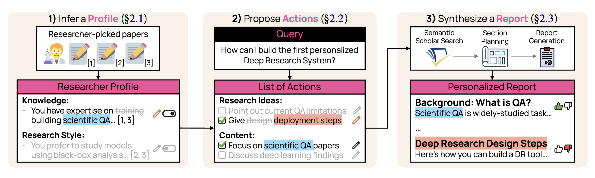

# Personalized ScholarQA Evaluation

This repository contains the evaluation logic for MyScholarQA, our personalized Deep Research System. The framework was introduced in the paper:

> **Language Models Don't Know What You Want: Evaluating Personalization in Deep Research Needs Real Users**



It implements pipelines for generating and evaluating *user profiles* (used interchangably with the word 'constitutions') and *personalized plans* (used interchangably with the word 'actions') to add extra information to users' Deep Research queries. We ran this evaluation with synthetic data and LLM-as-a-judge metrics to validate our system pre-deployment (§3). 

Further, it houses the logic for using LLM judges to try and simulate real user data derived from our qualitative interviews

---

## 📋 Overview

The codebase supports:

- **User profile (constitution) generation** — Inferring researcher preferences (knowledge, research style, writing style, positions, audience, etc.) from their published papers ().
- **Personalized plan generation** — Producing query-specific plans (search, organization, generation) conditioned on those profiles (§2.1, §2.2).
- **Profile evaluation** — Scoring constitutions on specificity, relevance, accuracy, categorization, and citation coverage (§3.2, §3.4).
- **Plan evaluation** — Assessing personalization alignment, query relevance, and category fit (§3.2, §3.4).
- **Simulation evaluation** — Predicting user preferences from prompts for qualitative analysis (§4.3).

We also ran evaluations of personalized report generation (§2.3, §3.4), but we are currently working on building a benchmark with real (not synthetic) user data and integrating it into [AstaBench](https://github.com/allenai/asta-bench) for experimental rigor. Stay tuned 👀

The UI and demo for Personalized ScholarQA live in a separate repository and deployment, described next.

---

## 🔗 Links

If you're interested in the **online MyScholarQA system**, check these out:

| Resource | Link |
|----------|------|
| 🌐 **Live demo** | [personalized-scholarqa.apps.allenai.org](https://personalized-scholarqa.apps.allenai.org/) |
| 💻 **UI repository** | [github.com/allenai/personalized-scholarqa](https://github.com/allenai/personalized-scholarqa) |
 
---

## 🛠️ Setup

This repository was tested with **Python 3.12.8** and **pip 25.0**. To get started, follow the steps below:

### 1️⃣ Clone the repository

```bash
git clone https://github.com/nbalepur/personalized-scholarqa-eval.git
cd personalized-scholarqa-eval
```

### 2. Install all requirements

```bash
python3 -m venv .venv
source .venv/bin/activate
pip install -r requirements.txt
```

### 3️⃣ Download paper objects

Profile and plan generation require preprocessed paper objects. Download and unzip them into the local datasets directory:

1. **Download** [paper_objects.zip](https://drive.google.com/file/d/1UJ8zNQy86IUZ_RdvQYMWslWZZ8WPzzWP/view?usp=sharing) from Google Drive.
2. Unzip so that paper files sit under `data/local_datasets/paper_objects/`:

   ```bash
   # From repo root
   unzip /path/to/paper_objects.zip -d data/local_datasets/
   ```

   Ensure the layout is `data/local_datasets/paper_objects/<paper_id>.json` (or as expected by `NewPaper.from_json` in the code).

### 4️⃣ Environment variables

Copy the example env and add API keys for the LLM providers you use (OpenAI, Anthropic, Gemini, and/or LiteLLM):

```bash
cp example.env .env
# Edit .env and set OPEN_AI_TOKEN, ANTHROPIC_TOKEN, GEMINI_TOKEN, etc.
```

---

## 📁 Dataset Information

All dataset is expcted under `data/local_datasets/`:

- **`paper_objects/`** — Paper JSONs (from the zip above) that form the inputs for profile generation
- **`simulated_profile_inputs/`** — A dataset of real Deep Research queries to form evaluation inputs
- **`qualitative_coding_data/`** — Our validation set for LLM simulation reliability derived from our qualitative interviews

---

## 🚀 Usage

We provide several scripts in the `scripts/` folder for the main workflows:

### 📝 Generating profiles and plans

From the repo root:

```bash
# Edit paths and model in scripts/generate.sh, then:
./scripts/generate.sh
```

This runs:

1. **Profile generation** — `model.user_profile.generate_profile_batch` (reads paper collections from `data_input_dir`, uses `paper_dir` for full text, writes to `profile_output_dir`).
2. **Plan generation** — `model.plan.generate_plan_batch` (reads profiles and inputs, writes to `plan_output_dir`).

Adjust `paper_dir`, `data_input_dir`, `profile_output_dir`, `plan_output_dir`, `model_name`, and `model_type` in the script as needed.

### 📊 Evaluating profiles

```bash
# Edit paths and model in scripts/eval_profile.sh, then:
./scripts/eval_profile.sh
```

Runs `evaluation.eval_profile` and then `metric_scores.profile_metrics` to produce profile evaluation outputs and summary metrics.

### 📈 Evaluating plans

```bash
# Edit paths and model in scripts/eval_plan.sh, then:
./scripts/eval_plan.sh
```

Runs `evaluation.eval_plans` and `metric_scores.plan_metrics` for plan evaluation and metrics.

### 🧪 Simulation (user-prediction) evaluation

```bash
# Edit paths in scripts/simulation.sh, then:
./scripts/simulation.sh
```

Runs `evaluation.predict_user_data` and `metric_scores.simulation_plot` for the qualitative/simulation experiments.

---

## 📂 Project structure

```
├── data/                    # Dataset loaders, paper/profile/plan types
├── evaluation/              # Eval runs, rubrics, metrics, predict_user_data
├── llms/                    # Model wrappers (OpenAI, Anthropic, Gemini, LiteLLM)
├── metric_scores/           # Profile/plan metrics and simulation plots
├── model/
│   ├── user_profile/        # Constitution (profile) generation
│   └── plan/                # Personalized plan generation
├── prompt/                  # Templates and user-prediction prompts
├── scripts/                 # Shell scripts for generate / eval / simulation
├── example.env
└── requirements.txt
```

---

## 📚 Citation

If you use this code or the Personalized ScholarQA evaluation framework in your work, please cite:

```bibtex
{
Coming soon!
}
```

## 📄 License

This project is licensed under the Apache License 2.0. See the LICENSE file for details.

## 📧 Contact

This work was done during my wonderful internship at Ai2's Semantic Scholar team!

If you encounter any issues that are easy to fix, we would appreciate it if you made a pull request. For any other concerns or questions about our paper, please reach out to:

- Nishant Balepur, Intern (nishantbalepur@gmail.com)
- Aakanksha Naik, Mentor (aakankshan@allenai.org)

